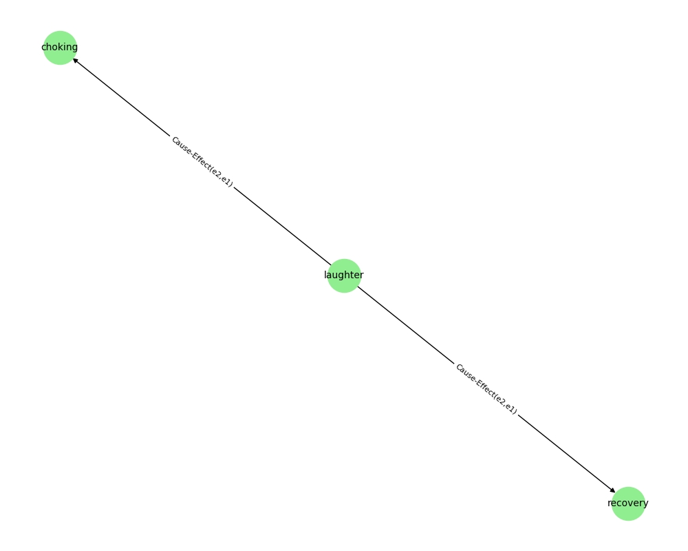

# Relation Extraction with Classic ML and LLM Approaches

This repository contains the official implementation of a relation extraction pipeline for building knowledge graphs from text using both classical machine learning and modern large language models (LLMs).

## Overview

We address the task of relation extraction between named entities in plain text. Our system builds a knowledge graph from input documents using two distinct approaches:

* **Classic ML-based approach** — using feature engineering (POS tags, NER, dependency paths, context) and a Random Forest classifier.
* **LLM-based approach** — using a fine-tuned transformer model to infer relations directly from the entity context.

Both methods produce triplets of the form:
`(Entity1, Relation, Entity2)`, which can be visualized as graphs using `networkx`.

---

## Requirements

To install dependencies, run:

```bash
pip install -r requirements.txt
```

The required packages include:

* `pandas`, `scikit-learn`, `spacy`, `transformers`, `torch` — for data handling and model building
* `datasets`, `huggingface_hub` — for accessing and storing pre-trained models
* `matplotlib`, `networkx` — for graph visualization
* `en-core-web-sm` (downloaded via URL) — for English language processing with spaCy

---

## Running Experiments

To run experiments, use the following command:

```bash
python main.py --model [classic|llm]
```

### Options:

* `--model classic` — Run the classic machine learning pipeline (Random Forest on extracted features)
* `--model llm` — Run the LLM-based method using transformer embeddings and downstream classification

Each run produces:

* Evaluation metrics (precision, recall, F1) saved as `.json` in the `results/` folder
* Predictions saved as `.csv` for further inspection or graph construction

Example:

```bash
python main.py --model classic
```

---

## Project Structure

```
.
├── main.py                  # Entry point for running experiments with different models
├── models/
│   ├── classic_model.py    # Feature extraction and Random Forest classifier
│   └── llm_pipeline.py        # Transformer-based relation classification
├── classic_model.ipynb   # Notebook implementing the classic feature-based approach (Random Forest)
├── llm.ipynb       # Notebook implementing the LLM-based approach (BERT-MTB)
├── requirements.txt          # Python dependencies
├── README.md                 # Project documentation
└── results/
    ├── classic_predictions.csv      # Model predictions for classic approach
    ├── classic_metrics.json         # Evaluation metrics for classic approach
    ├── llm_predictions.csv          # Model predictions for LLM-based approach
    └── llm_metrics.json             # Evaluation metrics for LLM-based approach

```
---

### Experimental results

The table below shows the evaluation metrics for the relation extraction task on the test set. We compare the performance of the classic feature-based model (Random Forest) with the LLM-based method (`bert-base-uncased`).

| Model          | Accuracy | Macro F1 | Weighted F1 |
| -------------- | -------- | -------- | ----------- |
| Classic (RF)   | 0.605    | 0.572    | 0.600       |
| LLM (BERT) |  0.529    | 0.552    | 0.532       |

The classic model significantly outperforms the LLM-based method on this dataset, likely due to better handling of sparse and structured linguistic features with traditional feature engineering. The LLM-based approach shows some promise for certain classes but suffers from overall class imbalance and lack of fine-tuning.
 
Graph generated from predictions of the classic ML model with 3 entities and relations:


Graph generated from predictions of the LLM-based model with 3 entities and relations:


